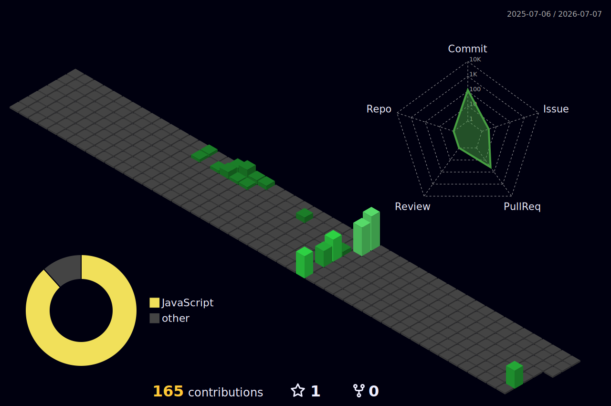

  

  

<strong>🛠️ Tech Stack 🛠️</strong>

  
  
  
  
   
  
  
  
  

 

<strong>📚 Learning 📚</strong>

  
  
  
   
  
  

 

<strong>🧰 Tools 🧰</strong>

  
  
  
  
   
  
  
  

 

<strong>📬 Connect 📬</strong>

  
  

 

 

<strong>📊 GitHub Stats 📊</strong>

  
  

 

<strong>🌱 3D Contributions 🌱</strong>

  

